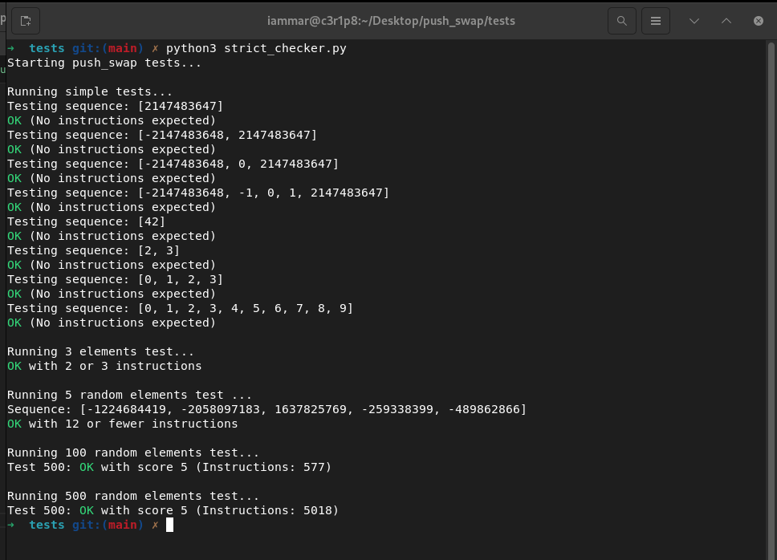

Push Swap Tester
================

This Python script is designed to test the `push_swap` program by providing various input sequences and validating the output against sorting rules. The tester checks correctness, execution time, and the efficiency of the sorting instructions generated by `push_swap`.

* * * * *

Table of Contents
-----------------

-   [Overview](#overview)
-   [Features](#features)
-   [Requirements](#requirements)
-   [Usage](#usage)
    -   [Basic Usage](#basic-usage)
    -   [Test Cases](#test-cases)
-   [Program Workflow](#program-workflow)
-   [Error Handling](#error-handling)
-   [Customization](#customization)

* * * * *

Overview
--------

The `push_swap` program is expected to sort stacks of integers using specific operations (`sa`, `pb`, `ra`, etc.) while minimizing the number of operations. This tester validates the correctness of `push_swap`'s output and measures its performance against standard benchmarks.

* * * * *

Features
--------

-   **Input Validation**: Checks for non-numeric values, duplicates, and out-of-bounds integers.
-   **Operation Validation**: Ensures that the sequence of operations results in a sorted stack.
-   **Performance Scoring**: Rates the efficiency of `push_swap` based on the number of operations.
-   **Automated Tests**:
    -   Simple edge cases.
    -   Randomized sequences of 3, 5, 100, and 500 elements.
-   **Timeout Handling**: Flags the program if it exceeds the execution time limit.

* * * * *

Requirements
------------

-   Python 3.6 or later.
-   `push_swap` executable compiled in the project directory (`./push_swap`).
-   Standard Python libraries (`subprocess`, `random`, `sys`).

* * * * *

Usage
-----

### Basic Usage

1.  **Compile `push_swap`**: Ensure the `push_swap` program is compiled and located in the root directory.

    `gcc -Wall -Wextra -Werror push_swap.c -o push_swap`

2.  **Run the Tester**: Execute the Python script.

    `python3 push_swap_tester.py`

### Test Cases

The script runs the following tests:

1.  **Simple Tests**:
    -   Tests small sorted and unsorted sequences.
2.  **3-Element Test**:
    -   Validates correctness and minimal moves for 3-element sequences.
3.  **5-Element Test**:
    -   Randomized test for 5-element sequences with a limit of 12 moves.
4.  **100-Element Test**:
    -   Benchmarked against performance ranges for up to 700 moves.
5.  **500-Element Test**:
    -   Evaluates larger sequences with performance scores based on operation count.

* * * * *

Program Workflow
----------------

1.  **Input Validation**:
    -   Rejects non-integer inputs, duplicates, or values out of range.
2.  **Command Generation**:
    -   Converts the input sequence to a string format for `push_swap`.
3.  **Execution**:
    -   Runs `push_swap` and captures the output.
4.  **Simulation**:
    -   Replays the operations to verify correctness.
5.  **Performance Scoring**:
    -   Scores the efficiency of the sorting solution.
6.  **Output**:
    -   Displays detailed results for each test.

* * * * *

Error Handling
--------------

-   **Invalid Input**: Displays an error for non-numeric, duplicate, or out-of-bounds values.
-   **Timeouts**: Flags tests where `push_swap` takes too long.
-   **Invalid Operations**: Identifies invalid or undefined operations in `push_swap`'s output.

* * * * *

Customization
-------------

-   **Modify Test Cases**: Add or change test cases in the `simple_tests`, `test_3_elements`, `test_5_random_elements`, `test_100_random_elements`, or `test_500_random_elements` functions.

-   **Adjust Timeouts**: Update the `timeout` parameter in the `subprocess.run` call for stricter or lenient timing.

* * * * *

Example Output
--------------

* * * * *
